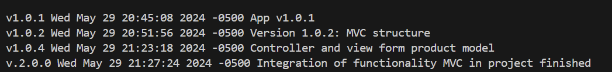

# Versions and tags GITHUB
This is a simple Java project to demonstrate version management with Git.

## Version 1.0.0
- Initial version of the project.

## Version 1.0.2
- MVC Structure and Model Class
## Version 1.0.3
- Including generic data for our project
## Version 1.0.4
- Controller and view form product model
## Version 2.0.0
- Integration of functionality MVC in project finished

Imagen de las versiones

